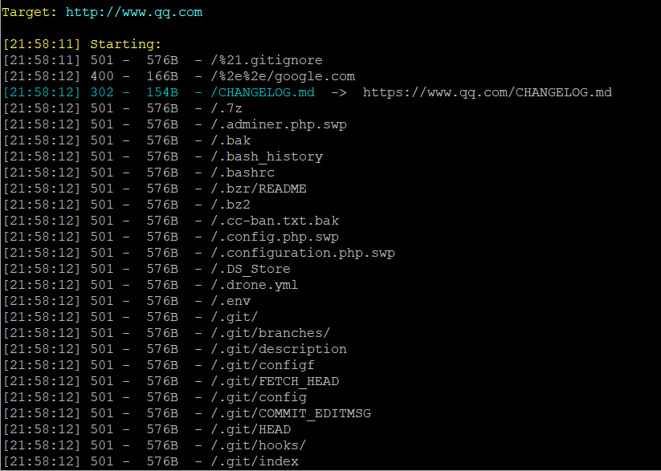
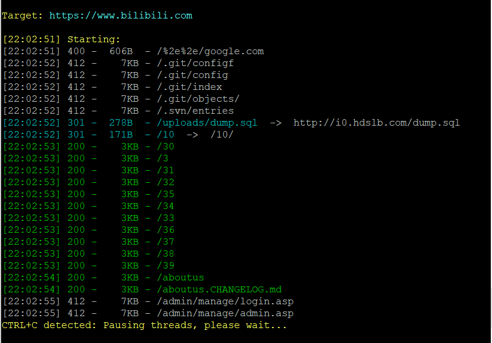
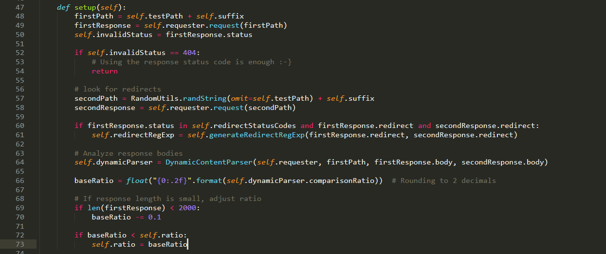
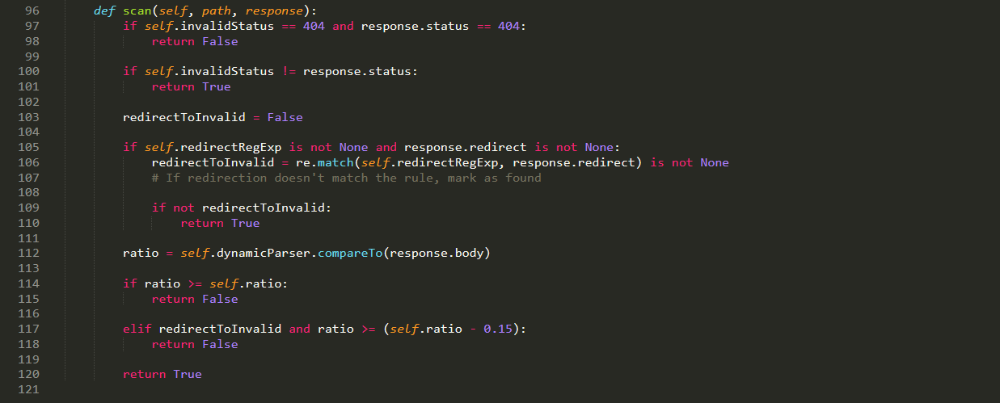
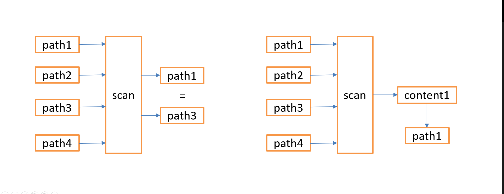

# 从 Dirsearch 看目录扫描

## Dirsearch 的缺陷

经常用 Dirsearch 的同学应该会发现这个工具的一个缺陷，在某些场景会出现大量误报，典型的就是有 WAF 的场景，所有触发  WAF 的目录都会误报出来，下面是分别扫 qq.com，bilibili.com 的扫描结果，qq.com 的误报有502，501，bilibili.com 的误报有 412，触发这些误报的目录都是满足特定规则的目录，比如 WAF，以及一些其他定制 URL 的模板。为什么会有这些误报，这就得从 Dirsearch 的工作原理说起了。

## Dirsearch 工作原理

dirsearch 的工作原理和现在的主流目录扫描原理一样，探测 404 页面，将扫描的所有目录返回结果与探测出来的 404 页面做相似度对比，相似度达到某阙值则认为该目录不存在。因此扫描的准确率取决于 404 页面的探测与相似度的对比，先来看 404 页面的探测，下面是探测 404 页面的关键函数，该函数位于 /lib/core/Scanner.py。

首先请求 testpath （随机字符串组成的路径） ，获取状态码，如果是 404 则终止后面逻辑，将状态码404作为判断标准。

如果不是 404，再次生成一个随机字符串的路径并请求做对比，然后判断是否是 30x 跳转，如果是跳转提取 Location，从两次跳转的 Location 中提取相同部分并生成一个正则，此时判断目录存在与否的标准就是状态码为30x，且 Location 的正则匹配成功则认为目录不存在。

如果不是 404 也不是 30x，则通过两次请求的返回内容生成一个 404 页面模板，利用扫描目录的返回与 404 页面做相似度比较判断目录是否存在。

然后是目录存在与否的判断逻辑，依次判断 404 状态码，30x 的正则，页面相似度的比较，顺带一提，这里的相似度用的是 sqlmap 中的模块，不是简单将两个页面直接比较，而是会先做数据清洗，去除一些动态内容，提高准确度。

再回到之前的问题，为什么 WAF 或类似 WAF 的机制会导致误报，因为 dirsearch 只获取了一个 404 页面的模板，要么 404，要么 30x + Location，要么状态码+页面相似度，在确定了 404 页面后只要特征和 404 页面不一致则认为目录存在，而访问某些 URL 触发 WAF 页面，页面与 探测出来的 404 页面不一致，则报目录存在。总结一下就是：**扫描器认为 404 页面只有一个，而实际场景中 404 页面可能不止一个**。

其实 dirsearch 在开发的时候可能意识到了这个问题，所以在使用的时候提供了选项可以忽略特定状态码或者页面包含特定内容的扫描结果，在使用者发现大量误报时可以手动过滤这些误报，功能设计上没问题，但如果用于批量扫描想利用人工去除误报就不现实了，必须要有自动化去误报的能力，或者说去掉部分误报。

## Dirsearch 改进

既然扫描器因为只获取一个 404 页面造成了误报，那我们在探测 404 页面的时候定义多个请求，并保存多个 404 页面特征就能就能解决这部分误报，这里又会有一个问题，如何尽可能的获取全 404 页面，这就得靠定制请求的覆盖率了，WAF 比较好触发，请求 `随机字符串/etc/passwd` 即可获取 WAF 特征，还有一些其他的亲求，比如 url 中包含 admin 则跳转至登录页，所以最终误报率取决于定制请求能触发多少这种 404 页面。这个只能靠经验了，不过场景较多的就是 WAF。

按照这个思路我简单的改了下 [dirsearch](https://github.com/Fuinow/dirsearch)，我做了什么，构造多个不存在的目录，尽可能触发不同 404 页面，将所有页面的特征做对比，选出不同的 404 模板作为判断标准，测试了几个有 WAF 的站点，WAF 相关的误报基本能解决。

## 不一样的扫描思路

即使改进了 404 页面的探测，但这个工具还是有缺陷，那就是前面说的依赖测试请求能触发多少 404 页面，针对一些 URL 有特殊规则的站点很难探测出所有 404 页面。那么有没有一个完美的解决方案呢？

我们做目录扫描的目的是什么？是获取 URL 吗？不是，我们更多的是关注 URL 对应的页面的内容，目前的目录扫描都是以 URL 为基准，想要尽可能的获取更多有效的 URL ，而不是获取更多有效内容（这两者有差别，细品），所谓的 404，30x，相似度其实都在解决一个问题，那就是不同 URL 指向了同一或类似页面，想要减少这种页面的扫描结果。那能不能一开始就以页面内容为基准呢？加载字典，依次访问不同的路径，将返回的页面保存，后续请求中获取的内容如果已经保存过了，那直接认为这个目录 “不存在”，否则保存内容，并且记录一个访问到该页面的 URL 。当然，这里的页面是否已经“保存过”同样使用页面相似度的方法计算。

理论上用这种扫描方式能减少很多误报，自定义 404 页面，WAF 页面，跳转到登录页面，这些都只会报一次，并且本身不算是误报。可能会有人问 403，401 等目录信息对于安全测试来说可能会有利用价值，如果以内容为基准，那 403，401只会报一次，就漏掉了大量相应目录。这个也好解决，增加对 403，401等状态码的白名单即可，使用者可根据自己的需求设置要不要将所有 403，401目录显示出来。

目前这种扫描方式只是一个思路，具体可行性或者会带来哪些问题需要实践来验证，有时间尝试写一下这么一个工具。
