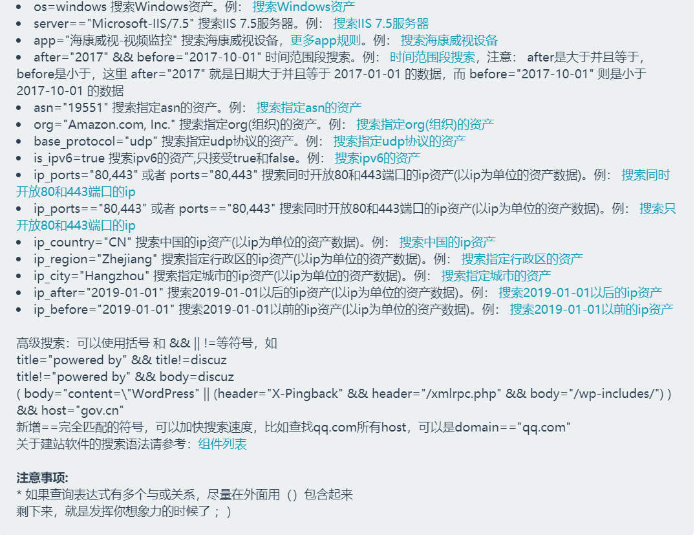
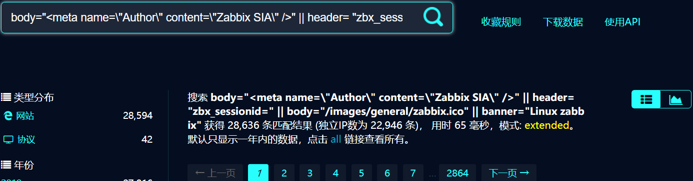
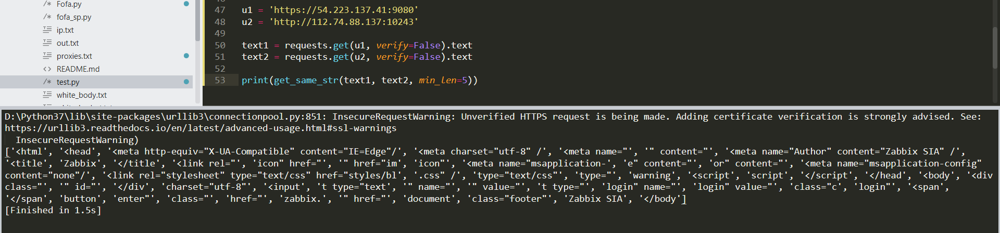
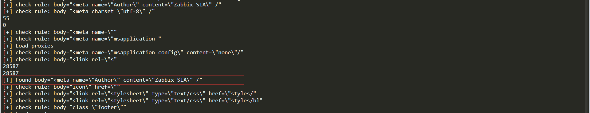
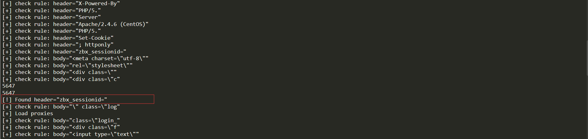
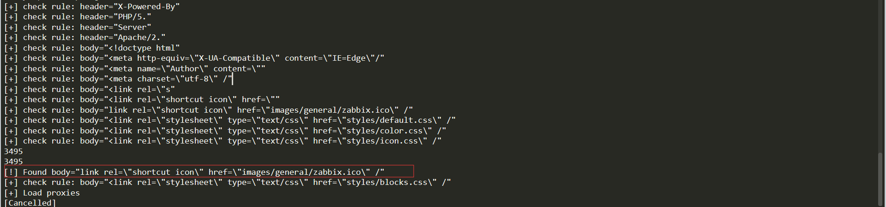

# 基于 FoFa 的自动化指纹提取

## FoFa的指纹识别

我所了解的 FoFa 做指纹识别仅仅是基于字符串的匹配，且只针对初始页面做匹配，对于 HTTP 协议来说也就是只对首页做规则匹配。

一般的个人指纹识别工具是先定制好请求，再检测该请求的返回是否具有特定特征，他的请求是黑盒的，可以是访问任意路径，带上任意参数，要想还原有很大难度，但 FoFa 不一样。只匹配首页的设定，使 FoFa 的请求是明的，还原指纹只需要还原首页的特征即可，而特征是基于 相同/相似 字符串匹配，如果能够找出多个样本中 相同/相似 的字符串，也就能还原 FoFa 的规则。

先简单看一下 FoFa 的基本搜索语法，搜索语法在 FoFa 首页即可查看，这里放上部分截图，主要有两点：1. 检索特定字段的字符串；2. 逻辑符连接多条语句。这里的 app=”dedecms“ 字段是一个规则集合，也就是 FoFa 自己录入的规则，他背后的形式是由多条子规则加上逻辑连接符组成，形如 

```header=xxx || body="xxxx" || body="xxx"......```

有价值的规则也就是这 APP字段 背后的规则。我们所需要提取的就是这些子规则。



## 基于 FoFa 的指纹提取

本文主题是”基于 FoFa 的自动化指纹提取“ ，在自动化之前需要实现手动的提取思路。 那么如何通过 FoFa 的基本的搜索语法来帮助我们提取子规则呢？这里做一个简单的演示，以提取 “Zabbix” 的指纹为例。首先搜索 Zabbix 的资产，搜索语法 app="Zabbix"，挑选其中两个资产为目标，人工的提取特征，这里我提取到的一个特征是  

 ```<meta name="Author" content="Zabbix SIA" />```

转化为 FoFa 的搜索语法即为

```body="<meta name="Author" content="Zabbix SIA" />"```

搜索这条语法能得到很多结果，看起来都是 Zabbix 资产，但可能会有误报，不是一条好的规则，要想验证这条规则只需要记下当前结果的数量C1 , 并搜索

```app="Zabbix" && body="<meta name="Author" content="Zabbix SIA" />```

记下数量 C2 ,这条语法的意思是满足子规则的同时满足他是 Zabbix， 如 C1=C2 则说明这条子规则是 FoFa 规则的一个子集，为一个有效的规则。

为了提取更多的子规则，可以搜索一下语法来获取新的资产

```app="Zabbix" && body!="<meta name="Author" content="Zabbix SIA" />"```

这条语法的意思的搜索 Zabbix 并排除满足刚才子规则的资产，在获得新资产后就能提取出新的规则，通过这种方式我提取出到了另一条子规则

```header= "zbx_sessionid="```

继续排除已提取指纹的指纹获取新资产。

 ```app="Zabbix" && body!="<meta name="Author" content="Zabbix SIA" /> && header!= "zbx_sessionid="```

一直重复上面步骤，直到排除资产的语法搜索结果为0。最终将所得到的子规则 或 起来，即可还原 FaFa 的规则，下面是我提取到的 Zabbix 规则，搜索结果数量和 FoFa 自带规则一致。

```body="<meta name=\"Author\" content=\"Zabbix SIA\" />" || header= "zbx_sessionid=" || body="/images/general/zabbix.ico" || banner="Linux zabbix"```




虽然不知道FoFa背后的规则是怎么样的，但自己提取的这条规则在 FoFa的平台上和 FoFa 自己的规则效果是相同的。

## 自动化的实现

要想实现自动化的指纹提取，需要满足以下三个条件：

	1. 大量的样本。
	2. 提取 两个/多个 样本中相同的字符串。
	3. 验证提取的字符是否为有效的指纹。

其中条件 1 和 3，可以通过上面的方式利用 FoFa 来实现，要实现的是第二条，如何代替手工提取指纹。理想的情形是输入两个网页的文本，返回一个List，里面包含所有相同的字符串，如何实现这个需求应该在算法的范畴了，这里我用了一个叫 **LCS最长公共子串** 算法思路来实现，原算法的场景是返回两字符串中最长的公共子串，我在其基础上做了一些修改，算法细节可以百度，比较简单，这里就不贴出来了，以下是我选择了两个 Zabbix 资产提取出的相同字符串部分。



只需要将提取的字符串带入到 FoFa 一个个验证即可提取里面正确的规则。为了减少无意义的验证，可以先随机抓取网页跑一下白名单，最后放几张效果图。



命中了三条规则，和前面手工提取的结果基本一致，但少了一条，因为最后一条规则在 banner 中，我写的 DEMO 只做了 WEB 内容的提取，所以手动停止了程序。

## 结语

最终的程序只是一个简单的 DEMON，来证明思路的可行性，实际要想通过这种方式获取 FoFa 所有的指纹还有一定难度，因为指纹规则很灵活，远不止相同字符串提取那么简单，比如子规则本身就是一条复合语句，这时候就需要对跑出来的相同字符串 List 做组合验证了，如何组合可能需要看过大量指纹的人才有可能给出可行的方案。但通过这种方式满足个人对部分指纹的需求是可行的。