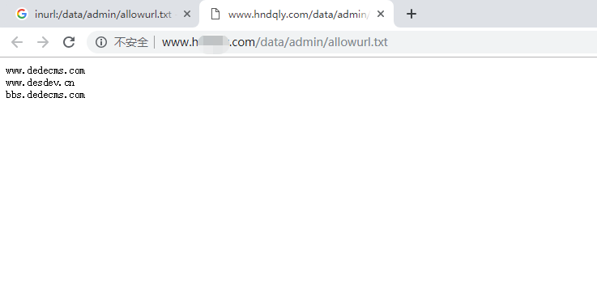
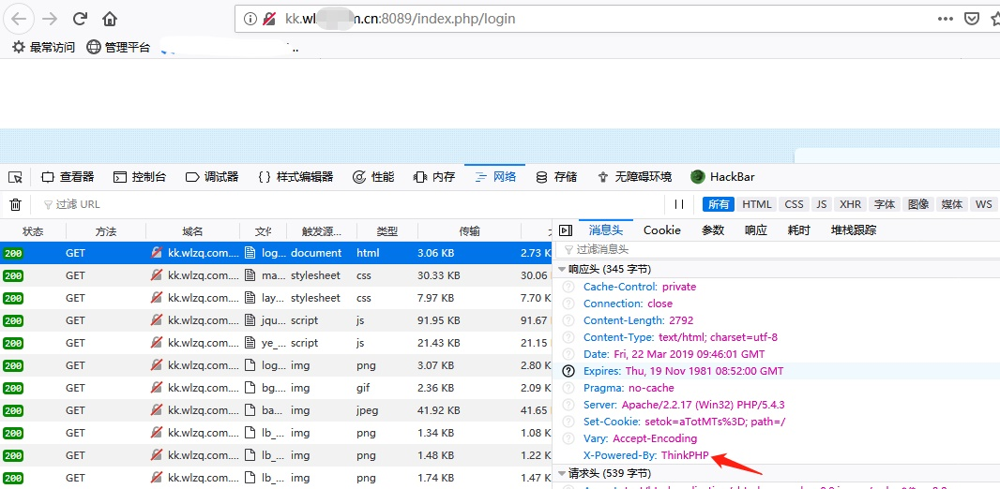
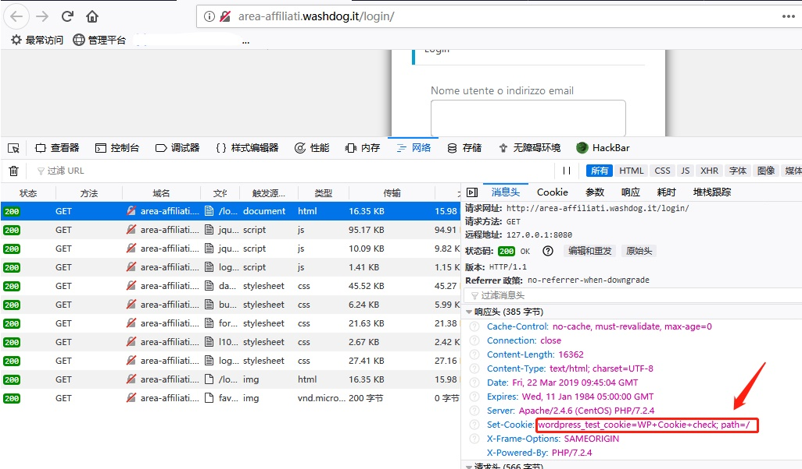
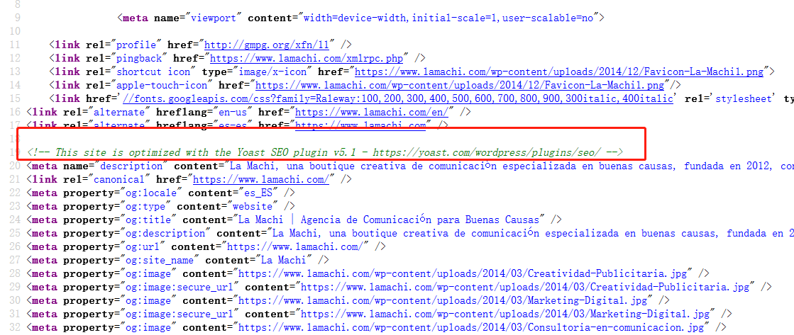

# 小白的扫描器之路之指纹识别

## 0x00 概述

指纹识别在信息收集中占有很大的分量，精准而全面的指纹识别能够帮助测试发现更多安全问题。如：cms，框架识别能够寻找相关通过漏洞，脚本语言识别能使用针对性的目录扫描字典及相关语言的trick，容器识别能利用不同容易的特性bypass（参数污染）等等。

## 0x01 指纹识别

指纹识别是寻找应用组件中一些独有的特征来对应用做识别，下面总结了一些常见的识别方式：

1. 访问特定url，匹配页面特征字符

2. 返回的header，包括Set - Cookie，X-Powered-By，Server及其他特殊字段。

3. 引入的js文件名

4. js代码块特征（函数命名，变量命名），有的应用在函数及变量命名规则比较特殊。

5. css特征（css文件名，css属性名）

6. body && title文本，注释













## 0x02 常规指纹识别工具

先来说一说常规的指纹识别工具，常规指纹识别的实现方式就是在规则中写请求与响应的特征，扫描器加载规则，按照规则构造数据包发送请求并检测返回结果，实现指纹识别。根据上面的几种识别方式，我们可以确定几个检测字段，即title，body，header，MD5值。规则如下：

```
{
"name" : "AspCMS",
"request": {
              "url" : "/install/",
              "method" : "GET",
              "headers": {},
              "data": {}
          },
"response": {
              "code": 200,
              "title": "",
              "body": "aspcms",
              "headers": {},
              "md5": ""
			}
}
```

按照request中的定义的请求访问`/install/`目录，如果返回200并且body中包含字符串`“aspcms”`则判定此站点使用了`aspcms`。这样在json中添加大量的规则，让扫描器加载就能实现常规的指纹识别功能。

以这样的方式扫描相对识别率较高，适用于对一个站点做精细的识别。可以按照需要随意定义请求方式与识别字段，并且可以随意定义不同请求方式的多条指纹，如再增加一条`aspcms`指纹.

```
{
"name" : "AspCMS",
"request": {
              "url" : "/apply/_notes/dwsync.xml",
              "method" : "GET",
              "headers": {},
              "data": {}
          },
"response": {
              "code": 200,
              "title": "",
              "body": "aspcms",
              "headers": {},
              "md5": ""
			}
},
```

但他的弊端也很明显，如果我有一万条指纹，那扫描一个站点就会发出一万条请求，这对于小站点来说可能压力过大，并且容易触发防御机制，容易被管理员发现并拦截等。

## 0x03 网络空间测绘

网络空间测绘的一个核心技术是指纹识别，他们的指纹识别原理可能和常规指纹识别原理相同，但应用场景不一样，实现方式不一样，借用某大佬的一个问题：

> 如果爆发一次安全事故，你能不能快速找出全球受影响的主机？

对于网络空间测绘来说可能这并不难，因为他们识别的目标对象就是全球的主机。那么，问题来了，如果按照常规指纹识别的方式，先录入规则，再根据规则发出相应的请求来识别，那每扫一个ip可能就要发出上万次请求，以这种速度扫完整个IPV4的外网地址是没有意义的。因此，常规扫描方式并不能实现网络空间测绘的预想功能。

网络空间测绘的扫描原理其实是先爬去网页保存到本地，再将爬取结果与本地的规则做匹配，他们**只爬首页**，没错，只爬首页，所以爬取的速度非常块，一个端口一条请求。但这样的实现方式在指纹识别上技术难度会增加，好几种识别方式都无法使用，比如访问特定url，获取icon的等。识别率上会有所降低，这是大幅提升速度所带来的代价，但使用剩下的几种方式任然可以识别大量指纹。

所以，只爬首页的扫描方式具有速度极快，识别率相对较低的特点。

## 0x04 我的指纹识别工具

前面两个指纹识别方式各有利弊，都有他们适用的场景，但和我期望的场景契合度都不是很高。首先，我所期望的指纹识别是针对SRC信息收集，SRC的资产很多，除了对指纹的收集还会收集一些其他信息，所以在扫描效率以及请求量上常规扫描不能满足需求。而扫描数量上也远远达不到全球IP那么多。所以采取一个折中的办法，将两种扫描方式结合。

在录常规方式扫描指纹时会发现一个问题，比如录入如下两条规则。

```
{
"name" : "ThinkPHP",
"request": {
              "url" : "/",
              "method" : "GET",
              "headers": {},
              "data": {}
          },
"response": {
              "code": 200,
              "title": "",
              "body": "",
              "headers": {"X-Powered-By": "ThinkPHP"},
              "md5": ""
			}
},
{
"name" : "WordPress",
"request": {
              "url" : "/",
              "method" : "GET",
              "headers": {},
              "data": {}
          },
"response": {
              "code": 200,
              "title": "",
              "body": "content=\"WordPress",
              "headers": {},
              "md5": ""
			}
},
```

这两条指纹虽然检测的方式不同，但他们的请求是相同的，都是访问首页。扫描器却要将同一请求对同一网站发起两次，那如果再录如一些相同请求的规则，录多少条，就重复请求多少次，这些完全是没有意义又浪费网络资源的请求。利用只爬首页的方式我们可以规避的这些请求。

因此，我将规则分为两类，一类是通用请求方式的规则，一类是特征请求方式的规则。通用请求方式的规则用类似网络空间测绘的方式做指纹识别，特征请求方式的规则用常规指纹识别方式。通用请求方式规则会搜集请求次数较多的规则，如`GET http://127.0.0.1/` ，`GET http://127.0.0.1/favicon.ico`，`GET http://127.0.0.1/install`等。

## 0x05 优化

受到某大佬的启发，觉得在扫描方面还能优化，到目前为止，扫描器还是会执行一些无意义的识别，比如这么一个场景：

扫描器已经识别出站点使用了`齐博CMS X1`，但任然会去识别站点是否使用了`ThinkPHP`（注：齐博CMS X1基于ThinkPHP开发），任然会去识别站点使用的脚本语言。由于他们之间的依赖关系，其实在识别出`齐博CMS X1`时就没有必要再去跑`ThinkPHP`，`PHP`的指纹了.

针对这种场景，我们可以对指纹分层，如容器层，语言层，框架层，应用层等，并建立依赖关系，优先跑上层指纹，并根据依赖直接确定下层指纹。对于具有唯一性的层比如脚本语言，容器，一旦确定则停止对该层指纹识别。所以现在的工作方式是：确定`齐博CMS X1`后根据依赖关系直接确定`ThinkPHP`，`PHP`同时去除`python`，`jsp`，`asp`等脚本语言相关指纹规则。

另外，也可以运用启发式扫描（统计命中次数，优先跑次数多的指纹）的思路进一步优化。

## 0x06 结语

目前我自己完成的指纹识别模块是常规的扫描方式，当我在写这篇paper时查阅了一些资料，才想到的这些方法论，还没有实践，然后就开始嫌弃自己之前写的识别模块了，日常嫌弃自己的工具系列。果然在动手之前有一套完整的方法论很重要。


