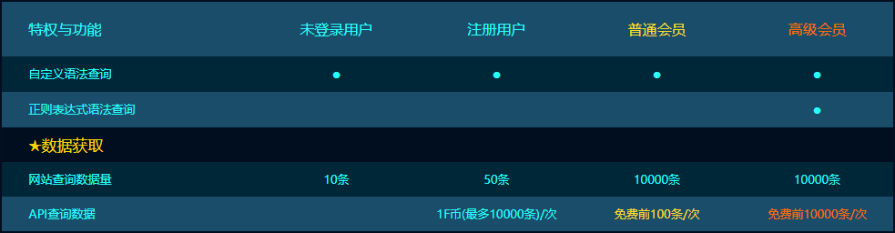

我想白嫖之突破FOFA查询限制

## FOFA 简介与查询限制

>FOFA是白帽汇推出的一款网络空间资产搜索引擎。它能够帮助用户迅速进行网络资产匹配、加快后续工作进程。例如进行漏洞影响范围分析、应用分布统计、应用流行度排名统计等。

FOFA 的作用很多，收集资产，帮助测试人员发现漏洞等，但 FOFA 有自己的查询限制，注册用户（免费）只能获取结果 50 条，即使是会员也只能获取 10000 条结果，当然也可以付费无限制查询。但我们可以利用 FOFA 的搜索语法突破这些查询i限制，说白了就是白嫖。




## 利用搜索技巧突破查询限制

先简单看一下 FOFA 的搜索语法，FOFA 通过一些特定字段来筛选资产，同时可以通过逻辑符号连接多条查询语句，构成复合查询语句，具体的查询字段可以在 FOFA 官网看到，这里放上部分截图。


今天的主角就是这些逻辑符号，现在我们以游客的身份来使用 FOFA（也就是最多能获取 10 条数据），假设我们想搜索的资产为 DEDECMS，而 FOFA 上的结果有 20条（假设），我们会这样搜索 ：

```app = "dedecms"```

最终出来的结果只有前 10条，但我们可以通过 ```!=```  连接符来排除已经获得的前 10 条结果，从而获取到后面 10 结果，什么意思呢？假设搜索的前 10 条结果 ip 分别为 ```1.1.1.1， 1.1.1.2， 1.1.1.3.....```我们先记下这些 IP 然后就可以这样搜：

```app = "dedecms" && ip != "1.1.1.1" && ip != "1.1.1.2" && ip != "1.1.1.3"...```

这样就能获取到后面 10 条的结果。整个思路就是排除已经获取的资产来继续回去后面的资产，这个过程完全是可以自动化完成的， FOFA 的查询请求为 GET 请求，只需要将查询语句 base64 带入 url 中即可查询结果，而查询结果也是可以直接爬取的，因此要实现自动化很容易。

但这样有一个问题，随着我们查询的资产数量的增多，需要排除的 IP 就会增多，查询语法也会加长，最终的查询 URL 会一直增加，当 URL 增加到一定程度后中间件就无法解析请求了，也就是说这样通过这种方法获取的资产会有一个上限。经测试 URL 的长度超过 3500 时就服务器就无法处理请求了，而 3500 的长度我们只能获取到 120 个资产左右。要想继续获取就需要突破这个 120 的限制。

## 分组突破 120 

既然通过排除 IP 的方法只能获取 120 个资产，那我们只需要将结果分组，每组资产数量低于 120（搜索结果中可直接获取数量） ，再分别获取。怎么个分法呢？FOFA 提供了丰富的查询字段，全部的查询字段可以在官网看到，这里列举几个 ```city="Beijing" country="CN" os=windows port="443"```，我们只需要给资产加上这些条件的限制，就能压缩资产的数量，压到 120 以内就可以全部获取。还是假设想获取 dedecms 的资产，而 dedecms 的资产有 210 个，其中 100 个在北京，另外 110 个在其他地区，那我们就能这样搜

```app = "dedecms" && city="Beijing"```

结果有 100 条

```app = "dedecms" && city!="Beijing"```

结果有 110 条

这两条搜索语法的资产数量都在 120 以内，那么就能分别用排除 IP 的方法来获取这 210 个资产了。

这里做了一个很理想的假设，实际使用中这些资产分布可能很不均匀且分组过后数量任然大于 120 ，这里就要用到多级分组了。FOFA 的搜素结果左侧会显示资产的分布情况，部分截图如下（每个维度只显示前5，另外可以归类为其他，即排除前五）。


有了这个分布信息我们就能从不同维度进行分组了，先从国家的维度分组，其中台湾（中国）和南非的数量低于 120 可以直接获取，中国的继续分，条件变为 中国 并且端口为 25，这样不断加限制条件压缩资产数量，直到压缩到 120 以下为止。下面以搜索 ```Coremail``` 资产为列，画了张搜索语法图。


图中从国家及端口的维度进行分组，实际使用中有更多的维度可以分，如城市，协议，组织等。可能有人会问，如果资产足够多，并且所有维度都分了，还是分不到 120 以下，怎么办。这时候还有一个杀手锏，那就是更新时间。before 和 after 是用来限定时间的，而这个时间是可以精确到天的，用法如下：

```app="dedecms" && after="2019-11-11" && before="2017-10-12"``` 

这条语法表示筛选出 2019-11-11 这天更新的 dedecms 资产，有了这个精确到天的时间过滤，很容易将分组数量压缩到 120 以内。

如果时间也加上了还是压不到 120 以内怎么办？那就买个会员吧，会员能一次获取 10000 ，也就是说只需要把分组的数量压到 10000 条以内就行了，这就很容易了。

## 总结

总结一下，利用排除 IP 的方法来获取资产，但只能获取到 120 个，再利用资产分布和时间进行分组，将每组数量压缩到 120 以内再分别获取。整个流程是自动化完成的。如果资产数量是万级别的，分到 120 一下可能有难度，但可以开会员用同样的方法突破会员 10000 条数据的限制。